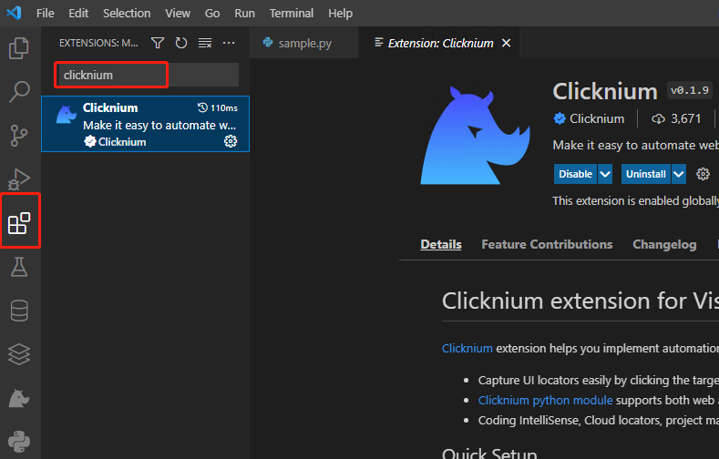

### Use python to batch scrape website images
Use the python automation library 'clicknium' and 'requests' library to batch download website pictures. Clicknium is a automation library that supports automatic operation of web sites and desktop software. The requests library can be used to send request to download pictures.
We use the clicknium library to obtain the image url, and the requests library to download it.

Clicknium can be used with vscode. It is very easy to get started. We try to use these two libraries to capture https://www.etsy.com website product images.

### Installation Steps
1. install vscode + python3.x
2. install vscode extension :clicknium
   
3. Complete the configuration according to clicknium extension Quick Setup, enable the chrome extension, and use github or Google account to authorize login

4. install requests module
   ```python
    pip install requests
   ```

### Program Steps
1. Open target site :etsy
2. Enter keywords in the search box and click the search button and wait for the page to load
3. Set sort by conditions
4. Get the product pictures in the first 5 pages and write them into the download folder
5. Close browser
   
### Source code
[source code of etsy](https://github.com/automation9417/etsy)

### How to run on my computer
Install and config by 'Installation Steps', download the source code from github, then open the etsy folder with vscode, and press F5 to run sample.py. The locate information used in the program is stored in ./locator/etsy.cnstore file, the program needs to get the locate information of the control from the file when running, so it needs to be included in the project.

``` python
import os
from time import sleep
from clicknium import clicknium as cc, locator, ui
import requests

search_key_word = 'mobile phone bag'

def main():
    # open the website
    tab = cc.chrome.open("https://www.etsy.com/sg-en/?ref=lgo")

    # input search keyword,and click the search button
    tab.find_element(locator.etsy.txt_search).set_text(search_key_word)
    tab.find_element(locator.etsy.btn_search).click()

    # wait 4 second to loading page content
    sleep(4)

    # set sort by condition
    tab.find_element(locator.etsy.btn_dropdown).click()
    tab.find_element(locator.etsy.dropdown_item_most_recent).click()
    sleep(4)

    # try get the top 5 pages 
    for page_count in range(0,5):
        similar_elements_img = tab.find_elements(locator.etsy.similar_img)
        print(f'page_count:{page_count}, similar_elements_img length:{len(similar_elements_img)}')

        index = 0
        for img in similar_elements_img:
            download_img(img,index)
            index+=1
        disabled = tab.find_element(locator.etsy.btn_next_page).get_property('disabled')
        if(disabled == 'true'):
            break
        else:
            tab.find_element(locator.etsy.btn_next_page).click()
            sleep(4)
    sleep(3)
    tab.close()
    

def download_img(img_obj,index):
    
    img_src = img_obj.get_property('src')
    print(f'index:{index},start download: {img_src}...')
    
    # img = requests.get(img_src, 
    #                 proxies=dict(http='socks5://127.0.0.1:10808',
    #                              https='socks5://127.0.0.1:10808'))

    img = requests.get(img_src)

    filepath = './download/'+img_src.split('/')[-1]
    i = 1
    while(os.path.exists(filepath)):
        filepath = f'./download/{img_src.split("/")[-1].split(".")[0]}-{i}.jpg'
        i+=1
    with open(filepath,'wb') as f:
        f.write(img.content)
    print(f'index:{index},download success!')

if __name__ == "__main__":
    main()

    

```